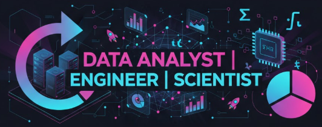

## Hi there 👋

  

<!--
**Sonali-at-work/Sonali-at-work** is a ✨ _special_ ✨ repository because its `README.md` (this file) appears on your GitHub profile.

Here are some ideas to get you started:

- 🔭 I’m currently working on ...
- 🌱 I’m currently learning ...
- 👯 I’m looking to collaborate on ...
- 🤔 I’m looking for help with ...
- 💬 Ask me about ...
- 📫 How to reach me: ...
- 😄 Pronouns: ...
- ⚡ Fun fact: ...
-->
# Hi 👋 I'm Sonali Patel

### 📊 Data Analyst | Python | SQL | Tableau | Machine Learning

💡 Passionate about turning data into insights  
📈 Love analytics, visualization & problem solving  
🚀 Always learning new tech  

---

### 🛠 Skills
- Python
- SQL
- Tableau
- Excel
- Statistics
---

### 📂 Featured Projects
🔹 Stock Price Prediction  
🔹 Sales Dashboard (Tableau)  
🔹 Customer Segmentation  
🔹 Finance Analytics

---

### 📫 Connect with me
- LinkedIn: https://linkedin.com/in/yourprofile
- Email: yourmail@gmail.com
